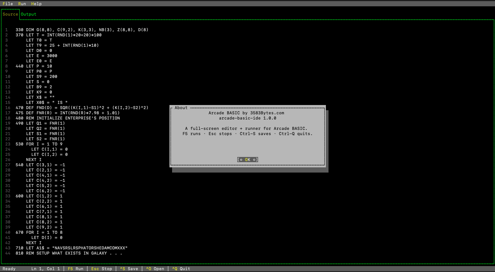
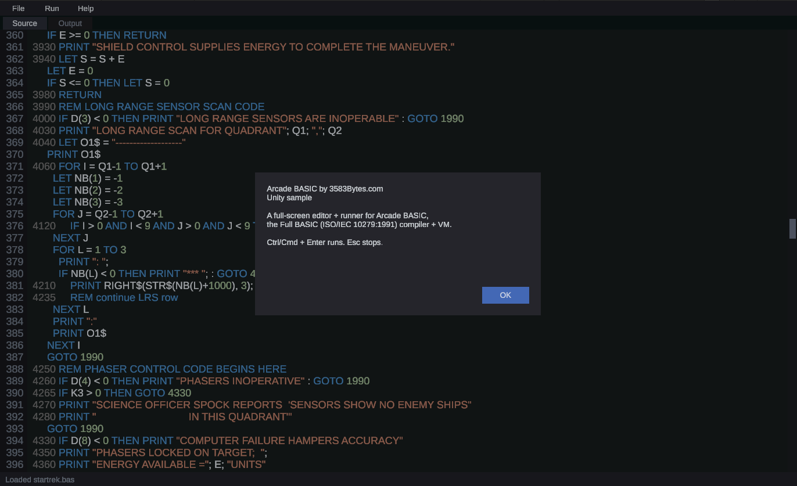

# Arcade BASIC

[](https://github.com/3583Bytes/Arcade-BASIC/actions/workflows/ci.yml)
[](https://github.com/3583Bytes/Arcade-BASIC/releases/latest)
[](https://dotnet.microsoft.com/)
[](https://www.iso.org/standard/18305.html)
[](LICENSE)

> A modern interpreter, compiler, and IDE for **Full BASIC** (ISO/IEC 10279:1991, ANSI X3.113-1987). Run classic BASIC programs, write new ones, embed BASIC in your .NET or Unity game, or ship a `.bas` file as a self-contained native binary.

| Terminal IDE (`arcade-basic-ide`) | Unity in-game IDE |
|---|---|
|  |  |

## In one minute

A tiny BASIC program:

```basic
PRINT "Hello, Arcade BASIC!"
FOR I = 1 TO 3
  PRINT "  squared:"; I; "->"; I * I
NEXT I
```

Run it on the interpreter:

```sh
$ arcade-basic run hello.bas
Hello, Arcade BASIC!
  squared: 1 -> 1
  squared: 2 -> 4
  squared: 3 -> 9
```

Same program, compiled to a self-contained native binary that runs anywhere — no .NET install required:

```sh
$ arcade-basic build hello.bas -o hello
$ ./hello
Hello, Arcade BASIC!
  squared: 1 -> 1 ...
```

Or embed it in your C# / Unity / Xamarin app:

```csharp
using ArcadeBasic;

BasicEngine.Run("PRINT 6 * 7", out var output);
Console.WriteLine(output);   //  42
```

## What you can do with it

- **Run vintage BASIC games.** The repo ships [`startrek.bas`](examples/startrek.bas) (Super Star Trek, Dave Ahl 1978) and [`lunar.bas`](examples/lunar.bas) (Storer's 1969 Lunar Lander), faithfully ported to Full BASIC.
- **Edit and run BASIC in a TUI IDE.** `arcade-basic-ide` opens a full-screen Terminal.Gui editor with line numbers, syntax classification, a problems pane, and one-key Run/Stop. See [Try the IDE](#try-the-ide).
- **Ship a `.bas` file as a one-file native binary.** `arcade-basic build foo.bas -o foo` produces a single executable for Linux, macOS (Intel + Apple Silicon), or Windows. No interpreter to install, no runtime dependency.
- **Embed BASIC in a .NET game or app.** The libraries multi-target `netstandard2.1`, so they drop into Unity (Mono and IL2CPP), Xamarin, .NET Framework, or any modern .NET host. Ideal for in-game scripting, modding hooks, or programmable retro consoles.
- **Learn how a language gets implemented.** Clean separation of lexer → parser → semantic analyzer → tree-walking interpreter and bytecode VM, all in one C# solution with extensive tests.

## Three ways to run a program

| | Command | Best for |
|---|---|---|
| **Tree-walking interpreter** | `arcade-basic run foo.bas` | The reference implementation. Fast to iterate on. |
| **Bytecode VM** | `arcade-basic vm foo.bas` | Stack-based VM over compact bytecode. Output is byte-identical to the interpreter. |
| **Native binary** | `arcade-basic build foo.bas -o foo` | Bundles the VM and your compiled program into a single self-contained executable — no .NET needed on the target. |

All three execute the same surface of the language: arrays, MAT operations (transpose, inverse, multiply, …), file I/O, `INPUT`/`LINE INPUT`, `READ`/`DATA`/`RESTORE`, `PRINT USING` with picture strings, modules with `PUBLIC` re-export, exception handling (`WHEN`/`USE`/`CAUSE`/`RETRY`/`CONTINUE`), and named handlers. Every example program runs the same on all three.

## Try the IDE

**Arcade BASIC IDE** is a full-screen terminal IDE: a source pane with a line-number gutter, an output pane, a bottom input line for `INPUT`, examples bundled into the **File ▸ Examples** menu, and one-key Run/Stop.

```sh
# From source:
dotnet run --project src/ArcadeBasic.Ide                       # empty buffer
dotnet run --project src/ArcadeBasic.Ide -- examples/hello.bas # open a file

# From a published binary (no .NET required):
arcade-basic-ide examples/startrek.bas
```

| Key    | Action                                                |
| ------ | ----------------------------------------------------- |
| F5     | Run the current source                                |
| F6     | Compile-check (syntax/type only, no execution)        |
| F7     | Build a standalone native binary from the current source |
| Esc    | Stop a running program                                |
| Ctrl-N | New buffer                                            |
| Ctrl-O | Open a `.bas` file                                    |
| Ctrl-S | Save                                                  |
| Ctrl-L | Clear the output pane                                 |
| Ctrl-Q | Quit                                                  |

Tagged releases ship the IDE as a self-contained single-file binary for `linux-x64`, `osx-arm64`, `osx-x64`, and `win-x64`. The .NET runtime is bundled inside the executable. See [`src/ArcadeBasic.Ide/README.md`](src/ArcadeBasic.Ide/README.md) for implementation notes.

## Try the REPL

```sh
arcade-basic repl
```

```
Arcade BASIC REPL — type .help for commands, .exit to quit.
> LET X = 42
> PRINT X * 2
 84
> FOR I = 1 TO 4
...   PRINT I, I * I
... NEXT I
 1               1
 2               4
 3               9
 4               16
> PRINT SIN(PI / 2)
 1
> .exit
bye.
```

Each accepted line is appended to a growing session source. Multi-line blocks (`FOR`, `DO`, `IF`, `SELECT`, `SUB`, `FUNCTION`, `DEF`, `MODULE`, `WHEN`) auto-detect and the prompt switches to `... ` until the block closes. Bad input doesn't pollute the session. `.list` shows the accumulated source; `.clear` resets it.

`INPUT` and `RANDOMIZE` don't round-trip cleanly through the REPL's re-execute-each-turn model — for those, save your code to a `.bas` file and use `arcade-basic run`.

## Example programs

13 sample programs in [`examples/`](examples/) — from `hello.bas` and `pi.bas` (Leibniz series) up to a complete Super Star Trek port and a Lunar Lander physics sim. Highlights:

| Program | What it shows |
|---|---|
| [`hello.bas`](examples/hello.bas) | `PRINT`, `IF`/`THEN`/`ELSE`, `FOR`, `^` |
| [`matrix.bas`](examples/matrix.bas) | `MAT` operations — `+`, `*`, `TRN`, `INV`, `IDN`, `MAT PRINT` |
| [`exception.bas`](examples/exception.bas) | `WHEN`/`USE`/`END WHEN`, `CAUSE`, `EXLINE`, `EXTYPE`, `RETRY` |
| [`modules.bas`](examples/modules.bas) | `MODULE` blocks, `PUBLIC` vs private declarations |
| [`fileio.bas`](examples/fileio.bas) | `OPEN` / `PRINT #` / `LINE INPUT #` / `CLOSE` |
| [`formatted.bas`](examples/formatted.bas) | `PRINT USING` with picture strings |
| [`startrek.bas`](examples/startrek.bas) | Super Star Trek (Dave Ahl, 1978) |
| [`lunar.bas`](examples/lunar.bas) | Lunar Lander (Jim Storer, 1969) |

See [`examples/README.md`](examples/README.md) for the full list with a tree-walker vs VM compatibility matrix.

## Embedding in .NET, Unity, Xamarin

The library projects (lexer through VM) multi-target **`net9.0`** *and* **`netstandard2.1`**, so they drop into anything from a modern ASP.NET host to a Unity game. The smallest possible embed:

```csharp
using ArcadeBasic;

var result = BasicEngine.Run("LET X = 6 * 7 \n PRINT X", out string output);
Console.WriteLine(output);  //  42
```

For Unity, the [`unity/`](unity/) folder is a ready-to-use UPM package — `package.json`, `ArcadeBasic.asmdef`, and an **Arcade BASIC IDE** sample. The sample is a single MonoBehaviour (`ArcadeBasicCodeEditor`) that builds its entire UI at runtime — menu bar (File / Run / Help), syntax-highlighted source pane with line gutter and scrollbar, scrollable output transcript with sticky-bottom auto-scroll, persistent INPUT bar, Problems pane, and Build Standalone command. Install via UPM git URL or unzip a tagged release ZIP into your project's `Packages/` folder. See [`unity/README.md`](unity/README.md).

## Quick build from source

Requires the .NET 9 SDK.

```sh
git clone https://github.com/3583Bytes/Arcade-BASIC.git arcade-basic
cd arcade-basic

dotnet build                                                    # debug build
dotnet test                                                     # all tests (~380, all green)
dotnet run --project src/ArcadeBasic.Cli -- run examples/hello.bas

# Produce an AOT-compiled standalone CLI for the current platform
# (PublishAot is set in the CLI csproj, so no need to pass it on the cmdline)
dotnet publish src/ArcadeBasic.Cli -c Release -r osx-arm64
# → src/ArcadeBasic.Cli/bin/Release/net9.0/<rid>/publish/arcade-basic
```

Pre-built binaries for Linux, macOS (Intel + Apple Silicon), and Windows are attached to each tagged GitHub release — both `arcade-basic` (the CLI) and `arcade-basic-ide` (the IDE), plus the Unity package zip. No .NET install needed on the target machine.

## CLI reference

```
arcade-basic <command> [args]

  run <file>              tree-walking interpreter (the reference path)
  vm <file>               compile to bytecode and run on the VM
  build <file> [-o out]   produce a self-contained native binary
  repl                    interactive Arcade BASIC session
  lex <file>              tokenize and print the token stream
  parse <file>            lex + parse, pretty-print the AST
  analyze <file>          lex + parse + sema, print symbol/DATA summary
  --version
```

Inspect intermediate stages of a program:

```sh
arcade-basic lex     examples/factorial.bas
arcade-basic parse   examples/factorial.bas
arcade-basic analyze examples/factorial.bas
```

## Documentation

- [**Keywords**](docs/keywords.md) — every reserved word with a description and a commented example. Start here if you're learning the language.
- [**Architecture**](docs/architecture.md) — the pipeline, project graph, key data structures, target-framework strategy.
- [**Standalone builds**](docs/standalone-builds.md) — how `arcade-basic build` turns a `.bas` into a single self-contained executable (it's a self-extracting bytecode VM, not a native-codegen pipeline; this doc explains the anatomy of the resulting binary and why the design was chosen).
- [**Contributing**](CONTRIBUTING.md) — build/test loop and concrete recipes for adding builtins, statements, opcodes.
- [**Conformance**](docs/conformance.md) — known deviations from ISO 10279:1991 and implementation-defined choices.
- [**Examples**](examples/README.md) — sample programs with a feature matrix across tree-walker and bytecode VM.

## How it's built

A clean compiler-pipeline-plus-VM in one C# solution. Each box is its own assembly so you can pull in only what you need:

```
   Source file
        │
        ▼
  Lexer ──► Parser ──► Sema ──┬─► Tree-walking interpreter ──► output
                              │
                              └─► Compiler ──► Bytecode VM ──► output
                                                  │
                                                  └──► self-extracting native binary
```

| Project | Purpose |
|---|---|
| `ArcadeBasic.Core` | source files, positions, diagnostics |
| `ArcadeBasic.Lexer` | tokenizer |
| `ArcadeBasic.Parser` | recursive-descent parser → immutable AST |
| `ArcadeBasic.Sema` | two-pass analyzer; symbol/scope resolution as a side table |
| `ArcadeBasic.Runtime` | `BigDecimal`-backed values, builtins, picture-string formatter, channels |
| `ArcadeBasic.Interpreter` | tree-walking interpreter with explicit handler stack |
| `ArcadeBasic.Bytecode` | opcode enum, chunk format, serializer |
| `ArcadeBasic.Compiler` | AST → bytecode lowering |
| `ArcadeBasic.Vm` | stack-based bytecode VM |
| `ArcadeBasic.Cli` | command dispatcher + self-extracting AOT stub |
| `ArcadeBasic.Ide` | full-screen Terminal.Gui editor + runner |

The interpreter and the VM share the same `Value` hierarchy, `BigDecimal` numerics, `MatOps` math kernels (LU-decomposition inverse, transpose, …), picture-string formatter, and channel table — so any program runs identically on both engines. The full architecture writeup lives in [`docs/architecture.md`](docs/architecture.md).

## License

[MIT](LICENSE) © 2026 Adam.
